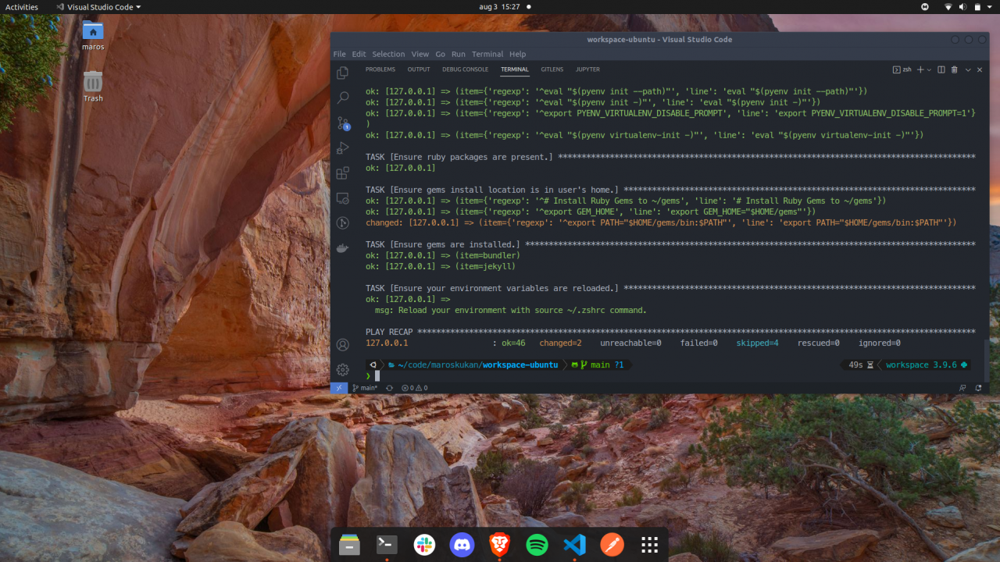

# Ubuntu Development Machine Workspace

- [Ubuntu Development Machine Workspace](#ubuntu-development-machine-workspace)
  - [Introduction](#introduction)
  - [Installation](#installation)
  - [Configuration](#configuration)
    - [Default](#default)
  - [Tips](#tips)
    - [Boot Options](#boot-options)
    - [Login Manager](#login-manager)


## Introduction

This repository contains wrapper scripts and Ansible playbooks that ensures that a fresh Ubuntu Linux installation has required software and configuration to support common development environment.

This project was inspired by Jeff Geerling's [Mac Development Ansible Playbook](https://github.com/geerlingguy/mac-dev-playbook).



## Installation

Clone or download this repository into your local machine. The wrapper scripts are located in `bin/` directory. As always, before execution I encourage you to explore content of any script.

The `bootstrap` script will ensure that:

1. Existing installed packages are up to date
2. Python3.8 or above is present
3. Pip3 is present
4. Ansible is present
5. Ansible playbook `main.yml` is executed

When ready, navigate to repository root and execute the bootstrap script.

```bash
bin/bootstrap
```

After first run the bootstrap script, you can use the `apply` shell script. This will skip steps 1-4 and just execute the playbook. This is useful when you want to reapply the playbook later.

```bash
bin/apply
```

## Configuration

### Default

These UI changes will be applied:

- [Papirus Icon Theme](https://github.com/PapirusDevelopmentTeam/papirus-icon-theme)
- [Nordic Dark theme](https://github.com/EliverLara/Nordic)
- [Yaru cursor](https://github.com/ubuntu/yaru)
- [Bind-wall](https://github.com/keshavbhatt/BingWall)

These Unity Launcher changes will be applied:

- Predefined application icon order
- Location is set to bottom
- Height extending is disabled
- Color is set to black with transparency set to 90%

These tools and applications will be installed:

- [bat](https://github.com/sharkdp/bat)
- curl
- [gh](https://github.com/cli/cli)
- [gnome-tweaks](https://wiki.gnome.org/Apps/Tweaks)
- iperf
- jq
- [kodi](kodi.tv)
- nmap
- neofetch
- openssl
- [packer](https://www.packer.io/)
- [pass](https://www.passwordstore.org/)
- shellcheck
- [terraform](https://www.terraform.io/)
- tree
- unzip
- [vagrant](https://www.vagrantup.com/)
- [vault](https://www.vaultproject.io/)
- zsh
- [brave](https://brave.com/)
- [discord](https://discord.com/)
- [rpi-imager](https://www.raspberrypi.com/software/)
- [postman](https://www.postman.com/)
- [spotify](https://www.spotify.com/)
- [vlc](https://www.videolan.org/vlc/)
- [vim](https://www.vim.org/)
- [code](https://code.visualstudio.com/)
- [slack](https://slack.com/)
- [virtualbox](https://www.virtualbox.org/)
- [docker](https://www.docker.com/)
- megasync
- [zoom-client](https://zoom.us/support/download)
- [xclip](https://github.com/astrand/xclip)


These VScode extensions will be installed:

- [vscode-icons](https://marketplace.visualstudio.com/items?itemName=vscode-icons-team.vscode-icons)
- [material-theme](https://marketplace.visualstudio.com/items?itemName=zhuangtongfa.Material-theme)
- [ansible](https://marketplace.visualstudio.com/items?itemName=redhat.ansible)
- [vscode-yaml](https://marketplace.visualstudio.com/items?itemName=redhat.vscode-yaml)
- [vscode-xml](https://marketplace.visualstudio.com/items?itemName=redhat.vscode-xml)
- [trailing-spaces](https://marketplace.visualstudio.com/items?itemName=shardulm94.trailing-spaces)
- [gitlens](https://marketplace.visualstudio.com/items?itemName=eamodio.gitlens)
- [python](https://marketplace.visualstudio.com/items?itemName=ms-python.python)
- [vscode-pylance](https://marketplace.visualstudio.com/items?itemName=ms-python.vscode-pylance)
- [markdown-all-in-one](https://marketplace.visualstudio.com/items?itemName=yzhang.markdown-all-in-one)

These build tools and applications will be installed for Python development.

- make
- build-essential
- libssl-dev
- zlib1g-dev
- libbz2-dev
- libreadline-dev
- libsqlite3-dev
- wget
- curl
- llvm
- libncursesw5-dev
- xz-utils
- tk-dev
- libxml2-dev
- libxmlsec1-dev
- libffi-dev
- liblzma-dev
- [pyenv](https://github.com/pyenv/pyenv/)

The following pyenv plugins will be installed.

- [pyenv-virtualenv](https://github.com/pyenv/pyenv-virtualenv)

These build tools and applications will be installed for Ruby development.

- build-essential
- ruby-full
- zlib1g-dev

The following Ruby gems will be installed.
- bundler
- jekyll


## Tips

### Boot Options

On certain laptop models, it happens that OS won't boot properly stopping with an error `Loading initial ramdisk`. Solution for this is to add `dis_ucode_ldr` to the default Grub boot arguments located at `/etc/default/grub`.

From:

```bash
GRUB_CMDLINE_LINUX_DEFAULT="quiet splash"
```

To:

```bash
GRUB_CMDLINE_LINUX_DEFAULT="quite splash dis_ucode_ldr"
```

Then

```bash
sudo update-grub
```

### Login Manager

To change the default login manager from `gdm3` to `lightdm` follow these steps:

```bash
# Install lightdm
sudo apt install -y lightdm

# If Login Manager selection dialog was not shown automatically
sudo dpkg-reconfigure gdm3
```

If you want to customize the default `unity-greeter` configuration edit the `/usr/share/glib-2.0/schemas/com.canonical.unity-greeter.gschema.xml` file.

Once update, recompile the schema:

```bash
sudo glib-compile-schemas /usr/share/glib-2.0/schemas
```

This should read the xml file and generate `/usr/share/glib-2.0/schemas/gschemas.compiled`.
